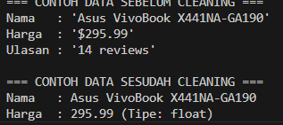
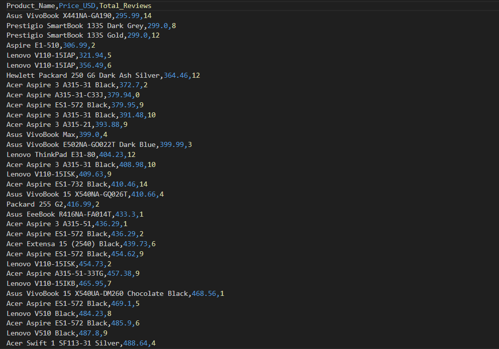

# Web Scraping & Data Cleaning Sederhana: Katalog Laptop E-Commerce

Repositori ini berisi script otomatisasi peramban (*browser automation*) menggunakan Python untuk mengekstraksi data web secara dinamis dari situs simulasi e-commerce. Script ini juga mencakup proses pembersihan data (*data cleaning*) dasar sebelum menyimpan hasil akhirnya ke dalam format CSV yang terstruktur.

## 🔗 Target Ekstraksi
- **URL Target:** [WebScraper.io - Laptops](https://webscraper.io/test-sites/e-commerce/allinone/computers/laptops)
- **Variabel yang Diekstrak:**
  1. Nama Produk (Laptop)
  2. Harga (USD)
  3. Jumlah Ulasan (Reviews)

## 🛠️ Pustaka yang Dipilih: Playwright (Python)
Tugas ini menggunakan pustaka **Playwright**.
**Alasan Pemilihan:**
Lebih cepat, Karena saya lebih mengenal phyton dibandingkan node.js

## 🧹 Logika Pembersihan Data (Data Cleaning)
Script ini mengambil teks mentah langsung dari elemen HTML dan memprosesnya dengan aturan berikut agar data siap dianalisis:
1. **Penanganan Missing Value:** Menggunakan validasi bersyarat `if not variable`. Jika elemen krusial seperti harga atau judul gagal terdeteksi, script akan otomatis melewati (*skip*) baris produk tersebut untuk mencegah masuknya data korup.
2. **Trimming:** Menerapkan metode `.strip()` untuk membersihkan *whitespace* (spasi berlebih) di awal dan akhir teks.
3. **Konversi Tipe Data Harga (Float):** Harga diekstrak dalam bentuk string mentah (misalnya `"$1,199.00"`). Fungsi Regular Expression `re.sub(r'[^\d.]', '', raw_price)` digunakan untuk membuang simbol mata uang dan koma, menyisakan angka utuh yang kemudian dikonversi menjadi tipe data `float` numerik (`1199.00`).
4. **Konversi Tipe Data Ulasan (Integer):** Teks ulasan (misalnya `"14 reviews"`) diekstrak menggunakan Regex `re.sub(r'[^\d]', '', raw_review)` untuk hanya mengambil digit angkanya saja, lalu dikonversi menjadi tipe data `int` agar bisa digunakan untuk agregasi statistik.

## 📸 Sampel Data: Sebelum & Sesudah Cleaning

